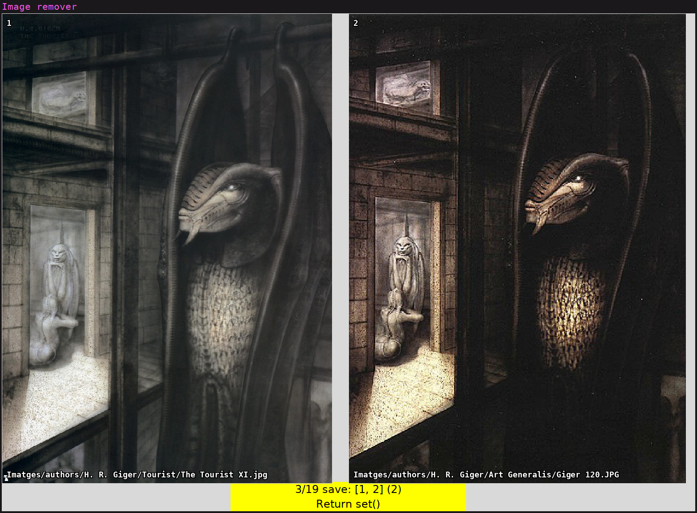
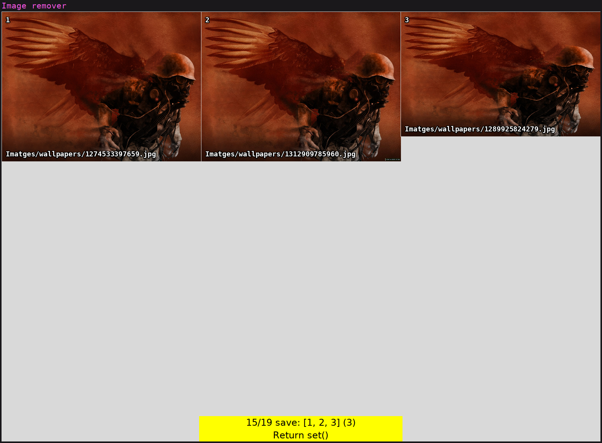

# Duplicate image remove assistant

This is a GUI tool I made in an afternoon to assist deleting repeated images.




# Usage

```
 ./duplicate_sh.py [duplicate_sets_list.txt] [output_script.sh]
```

## Keybindings

 - left/right arrow: go to previos/next image
 - [1-9]: select images to save
 - enter: confirm numeric selection
 - d: save only the first image
 - s: save all images (don't delete any)
 - w: write deletion script

# Dependencies

- `python-pillow`

# Input & Output

The tool takes as input a text file with list of similar/repeated images grouped in sets, like this:

```
Images/vg/1520136382070.jpg
Images/game posters/1549056255824.jpg

Images/space/planets/1529148850014.jpg
Images/space/planets/1529148851879.jpg
Images/space/planets/1529148854975.jpg
Images/space/planets/1540001496237.jpg

Images/to-classify/deviantart/dcky9lc-1dc57080-4f49-4a7c-830f-3969eaa29a43.jpg
Images/to-classify/deviantart/kicks_by_rossdraws-dcky9lc.jpg
Images/to-classify/deviantart/dcky9lc.jpg
```

The tool allows viewing each set of images at once to decide which ones to save
and which ones to delete.  The result is written to a shell script that can be
later executed.  The resulting script looks like this (showing the final
selection in a comment):

```
#!/bin/sh

# [0]
# rm 'Imatges/wallpapers/1274533397659.jpg'
rm 'Imatges/wallpapers/1312909785960.jpg'
rm 'Imatges/wallpapers/1289925824279.jpg'

# [0, 2]
# rm 'Imatges/wallpapers/1291557899968.jpg'
rm 'Imatges/wallpapers/1304163762136.jpg'
# rm 'Imatges/wallpapers/1312911526166.jpg'
rm 'Imatges/wallpapers/1314755398122.jpg'
```

# How to generate the list

This tool only focuses on assiting the deletion of repeated/similar images once
the list of repeated/similar images is done.  In order to get the list I
recommend using the [imgdupes](https://github.com/knjcode/imgdupes) tool from
knjcode.  It can be used from docker like this:

```
docker run -it -v $PWD:/app knjcode/imgdupes --sort imagesize --no-subdir-warning -m -r Images phash 2 | grep -v 'Calculating image hashes' | tee duplicate_sets_list.txt
```

imgdupes allows you to find similar images that have different resolutions or
contain minimal image variations.

The output file will need some cleaning to look like the example shown in this README.

# License

The code is released under the 3-clause BSD License.
